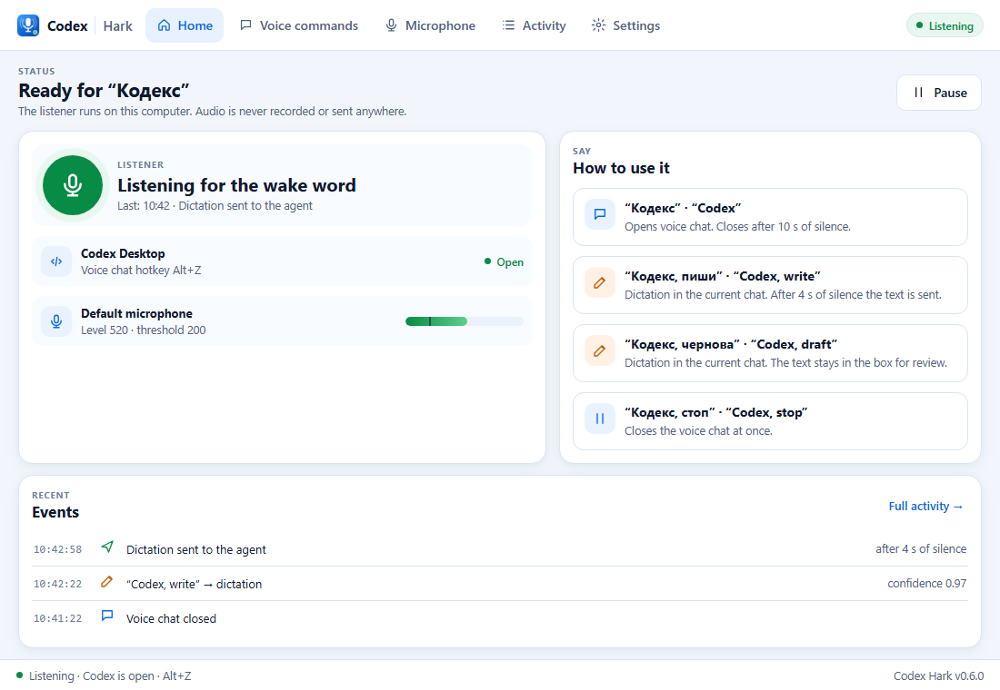
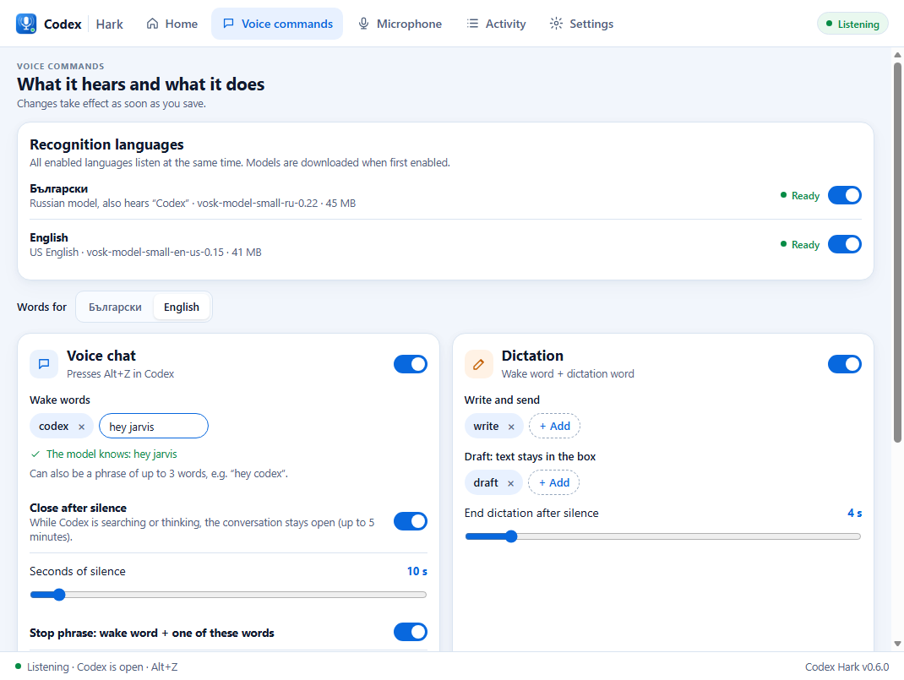

# Codex Hark

[English](README.md) · [Български](README.bg.md)

> Say "Codex" to open Codex Desktop voice chat on Windows. A local wake-word listener for English and Bulgarian.

Unofficial community project; not affiliated with or endorsed by OpenAI. "Codex" is the name of an OpenAI product.



## Why

Codex Desktop starts a voice chat with a hotkey (`Alt+Z`) but has no wake word, so you need a hand on the keyboard. Codex Hark listens for the word "Codex" on your computer, presses the hotkey for you, and closes the chat after a few seconds of silence, but not while Codex is still working.

| Say | What happens |
|---|---|
| "Codex" (Bulgarian: „Кодекс“) | Opens voice chat. Closes it after 10 s of silence, but not while Codex is searching or thinking |
| "Codex, write" („Кодекс, пиши“) | Dictates into the current chat; after 4 s of silence the text is sent to the agent |
| "Codex, draft" („Кодекс, чернова“) | Dictates; the text stays in the input box for review |
| "Codex, stop" („Кодекс, стоп“) | Closes the voice chat at once |

## Install

1. Download `CodexHark.exe` from [Releases](https://github.com/ID-Yo/codex-hark/releases).
2. Verify the checksum against `SHA256SUMS.txt`:

   ```powershell
   (Get-FileHash .\CodexHark.exe -Algorithm SHA256).Hash
   ```

3. Put the file anywhere (there is no installer) and run it. The app is not signed, so Windows SmartScreen may show "Windows protected your PC" on first run: choose **More info > Run anyway**.
4. The window opens and a blue microphone icon appears in the system tray. Turn on **Start with Windows** in Settings if you want it permanent.

Requirements: Windows 10 or 11 (64-bit) with the WebView2 Runtime (included in Windows 11), the Codex Desktop app, and `Alt+Z` set as the **Voice chat hotkey** in Codex settings.

## Use

Say the wake word near your microphone. Left-click the tray icon, or run the exe again, to open the window; the X button hides it and the listener keeps running. Quit from the tray menu.

| Screen | What it does |
|---|---|
| Home | Status, pause/resume, whether Codex is open, live microphone level, recent events |
| Voice commands | Recognition languages, words for each language, silence timeout, sensitivity |
| Microphone | Device choice, live level, speech threshold, automatic calibration |
| Activity | Last 1000 events with search and filters |
| Settings | Start with Windows, notifications, sound, interface language, theme, defaults |

Tray icon colors: green listening, blue voice chat, orange dictation, gray paused, red error. Settings are stored in `%APPDATA%\CodexHark\settings.json`.

The interface also opens in a browser with sample data: open `ui/index.html#home-light-en` (screen, theme and language are the parts of the hash).

## Change the wake word

Open **Voice commands**, choose the language and edit **Wake words**. A wake word can also be a phrase of up to three words, for example "hey jarvis" in English or „хей кодекс“ in Bulgarian. The command words (write, draft, stop) and the similar words stay single words.

The speech model recognizes only words from its own vocabulary. While you type, Hark checks every word against the model and tells you whether it can be used, so a word the model does not know is refused before you press **Save**.



- The Bulgarian slot uses a Russian model, so write Bulgarian words in Russian spelling (for example „хей“, „кодекс“). Words that exist only in Bulgarian, such as „бобър“, are not in the vocabulary.
- Choose a distinctive word that is rare in everyday speech. A phrase must be heard as all of its words in a row, and its confidence is the mean of its words' confidences.
- Put similar-sounding words in **Similar words**, so that near misses do not trigger the wake word.
- If the model of a language is not downloaded yet, its words cannot be checked. Hark then warns on start and marks in red the saved words the model does not know, because the listener ignores them.

## Languages

Each language has its own small offline [Vosk](https://alphacephei.com/vosk/) model and its own words. All enabled languages listen at the same time.

| Language | Model | Size |
|---|---|---|
| Bulgarian | `vosk-model-small-ru-0.22` (there is no Bulgarian Vosk model; the Russian one also understands "Codex"), bundled in the exe | 45 MB |
| English | `vosk-model-small-en-us-0.15`, downloaded on first use to `%APPDATA%\CodexHark\models` and checked by SHA256 | 41 MB |

Each enabled language adds about 200 MB of memory; CPU stays under 1%.

## How it works

1. The listener keeps the microphone open (16 kHz, mono) and feeds the audio to each enabled model. Recognition is limited to a short grammar: the wake words, the dictation words, similar-sounding decoy words and `[unk]`. So "code", "test" or "Alexa" trigger nothing, and "write" without "Codex" does nothing.
2. "Codex" with enough confidence presses `Alt+Z`, the global voice-chat hotkey of Codex.
3. "Codex, write" presses the `Dictate` button of the current chat through Windows UI Automation. After the silence timeout it presses `Transcribe and send`.
4. To know whether Codex is using the microphone, Hark reads the Windows microphone-consent registry key of the Codex package. A voice chat is closed with `Alt+Z` when both the microphone and the Codex audio output (measured with pycaw) are quiet for the silence timeout.
5. While a voice chat is open, Hark reads Codex's local thread-history database (read-only) to see whether the agent still has an unfinished turn. While it does, silence does not close the chat; after 5 minutes the silence rule applies again.
6. Only one copy runs at a time; starting a second shows the window of the first.

## Limitations and privacy

- Audio is processed on your computer by an offline model. It is never recorded or sent anywhere. The only network access is the one-time download of the English model from `alphacephei.com`, verified by SHA256.
- The activity log (`events.jsonl`, `wakeword.log` in `%APPDATA%\CodexHark`) stores event types, times and confidence values. It never holds audio or dictated text.
- Hark depends on internals of Codex Desktop: `Alt+Z`, the English button names `Dictate`, `Stop dictation` and `Transcribe and send`, the package name, the `ChatGPT.exe` process and the thread-history database. If Codex changes them, Hark needs an update.
- Say "Codex, write" as one phrase; a long pause between the words can open a voice chat instead.
- Silence thresholds were tuned on one laptop microphone; another microphone may need adjusting in the Microphone screen.
- On every start the exe unpacks about 200 MB to `%TEMP%` (usually drive C:) and removes it on exit.
- Synthetic speech from loudspeakers is recognized less reliably than a live voice.

## Uninstall

Turn off **Start with Windows**, choose **Quit** in the tray menu and delete the exe. Delete `%APPDATA%\CodexHark` as well if you want nothing left.

## Build from source

```powershell
py -3.13 -m venv .venv
.\.venv\Scripts\python -m pip install -r requirements.txt
.\.venv\Scripts\python -m unittest discover -s tests
.\.venv\Scripts\pythonw.exe app.py   # needs the Bulgarian model folder, see build.ps1
./build.ps1                            # clean venv, model check, tests, dist\CodexHark.exe and SHA256SUMS.txt
```

`build.ps1` downloads and verifies the Bulgarian model, runs the tests and builds one exe with PyInstaller. Every push builds the exe in GitHub Actions; +`+vX.Y.Z+`+ that matches +`+__version__+`+ in +`+wakeword.py+`+ creates a Release.`vX.Y.Z` that matches `__version__` in `wakeword.py` creates a Release.

## Project layout

| Path | Purpose |
|---|---|
| `app.py` | Tray icon, window (pywebview), single-instance handling, autostart |
| `wakeword.py` | Listener, recognition grammar, settings, language models |
| `ui/` | Window interface (HTML, CSS, JS) |
| `tests/` | Unit tests for the pure logic |
| `build.ps1` | Reproducible build and checksum |
| `.github/workflows/` | CI build and Release on version tags |

## Help and contributing

Questions and bugs: open an [issue](https://github.com/ID-Yo/codex-hark/issues). See [CONTRIBUTING.md](CONTRIBUTING.md) and [AGENTS.md](AGENTS.md) for coding agents. Security reports: [SECURITY.md](SECURITY.md). Changes: [CHANGELOG.md](CHANGELOG.md).

## License

MIT, see [LICENSE](LICENSE). Bundled third-party components and their licenses: [THIRD_PARTY.md](THIRD_PARTY.md).
